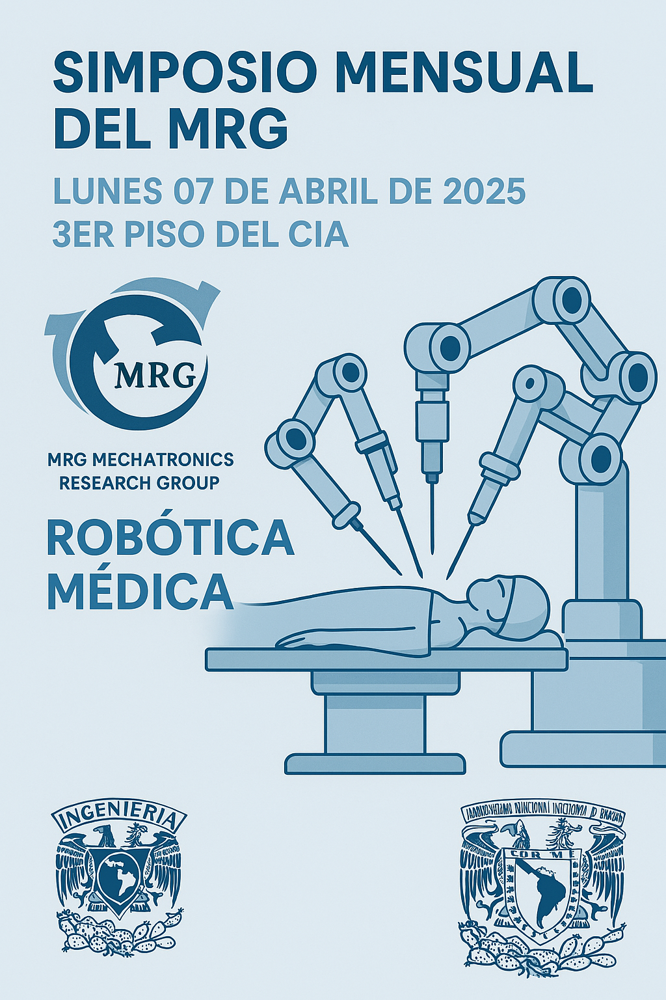
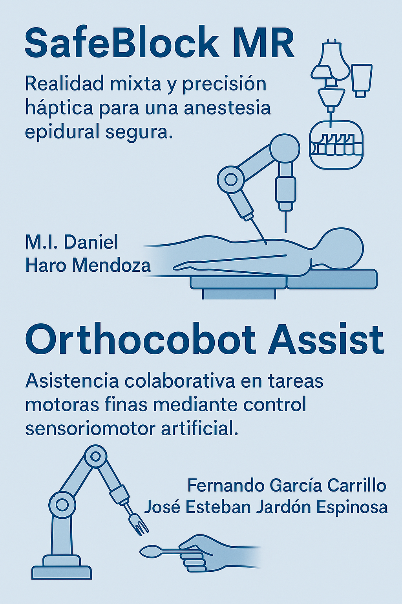

# Simposio Mensual del MRG 🤖

Bienvenidos al sitio oficial del **Simposio Mensual del Mechatronics Research Group (MRG)**.  
Aquí podrás encontrar información sobre nuestros eventos, proyectos y avances en **robótica médica**.

---

## 📅 Próximo evento: Lunes 07 de abril de 2025  
**Lugar:** 3er piso del CIA, Facultad de Ingeniería, UNAM

---

## 🧪 Proyectos presentados

- **SafeBlock MR**  
  Realidad mixta y precisión háptica para una anestesia epidural segura.  
  _Presenta: M.I. Daniel Haro Mendoza_

- **Orthocobot Assist**  
  Asistencia colaborativa en tareas motoras finas mediante control sensoriomotor artificial.  
  _Presentan: Fernando García Carrillo y José Esteban Jardón Espinosa_

---

Gracias por tu visita.  
Síguenos para conocer más sobre innovación, ingeniería y robótica médica 🚀
